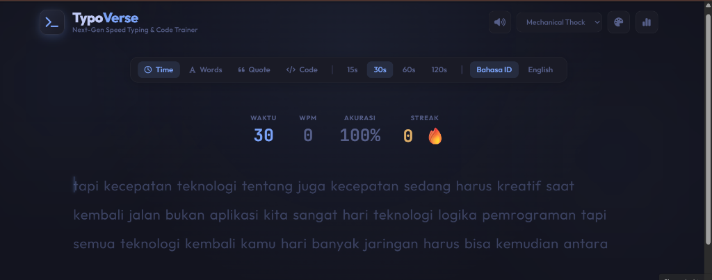

<div align="center">

<br/>

# ⌨️ TypoVerse

### *Next-Gen Speed Typing & Code Trainer*

[](https://developer.mozilla.org/en-US/docs/Web/HTML)
[](https://developer.mozilla.org/en-US/docs/Web/CSS)
[](https://developer.mozilla.org/en-US/docs/Web/JavaScript)
[](LICENSE)

**TypoVerse** adalah aplikasi web speed typing & code trainer generasi berikutnya — terinspirasi dari MonkeyType, dengan tampilan cyber-glow yang memukau, efek suara keyboard mekanik sintetis, dan berbagai mode latihan yang kaya fitur.

[🚀 Coba Sekarang](#-cara-menjalankan) · [✨ Fitur Lengkap](#-fitur) · [🎨 Tema](#-tema) · [⌨️ Shortcut](#%EF%B8%8F-keyboard-shortcuts)

</div>

---

## 🖼️ Tampilan Aplikasi



> Tampilan utama TypoVerse dalam mode **Time 30 detik** dengan bahasa Indonesia — menampilkan HUD real-time (Waktu, WPM, Akurasi, Streak 🔥) dan teks ketikan yang bercahaya.

---

## ✨ Fitur

### 🎯 Mode Typing yang Lengkap

| Mode | Deskripsi |
|------|-----------|
| ⏱️ **Time** | Ketik sebanyak mungkin kata dalam waktu 15s / 30s / 60s / 120s |
| 🔤 **Words** | Selesaikan sejumlah kata tertentu: 10 / 25 / 50 / 100 kata |
| 💬 **Quote** | Ketik kutipan inspiratif dari tokoh-tokoh terkenal |
| 💻 **Code** | Latihan mengetik kode nyata: JavaScript, Python, atau HTML/CSS |

### 📊 HUD Real-Time

Saat mengetik, kamu bisa memantau performa secara langsung:

- **WPM** — Kecepatan mengetik per menit (diperbarui setiap detik)
- **Akurasi** — Persentase ketepatan karakter
- **Streak 🔥** — Jumlah karakter benar berturut-turut tanpa salah
- **Waktu / Counter** — Countdown (mode Time) atau progress kata

### 📈 Hasil & Analisis Performa

Setelah tes selesai, kamu mendapatkan laporan lengkap:

- **WPM & Raw WPM** — Kecepatan bersih vs kecepatan mentah
- **Akurasi** — Persentase + detail benar/salah/ekstra/terlewat
- **Konsistensi** — Seberapa stabil ritme ketikanmu
- **Grafik WPM** (Chart.js) — Visualisasi laju kecepatan dari detik ke detik

### 🔊 Efek Suara Keyboard Sintetis (Web Audio API)

Tidak butuh file MP3! Suara dihasilkan langsung via browser:

| Profil Suara | Karakter |
|-------------|----------|
| 🎹 **Mechanical Thock** | Suara keyboard mekanik berat dan dalam |
| 🔵 **Cherry Blue Click** | Klik tajam dan snappy khas Cherry MX Blue |
| 💧 **Soft Bubble** | Suara lembut dan menenangkan |
| 🌐 **Cyber Beep** | Nada futuristik bergaya sci-fi |

> Suara error memiliki efek berbeda — langsung terasa saat kamu salah ketik!

### 🌍 Dua Bahasa

- 🇮🇩 **Bahasa Indonesia** — Kosakata teknologi, kehidupan, dan pemrograman
- 🇬🇧 **English** — Kata-kata umum dalam bahasa Inggris

### 🕹️ Fitur Tambahan

- **Riwayat & Statistik** — Lihat 10 tes terakhir + WPM tertinggi & rata-rata
- **Caps Lock Alert** — Peringatan otomatis jika Caps Lock aktif
- **Kembali ke Kata Sebelumnya** — Backspace dari kata berikutnya jika ada kesalahan
- **Auto-focus** — Langsung mulai mengetik tanpa klik apapun

---

## 🎨 Tema

TypoVerse hadir dengan **5 tema visual** yang bisa diganti kapan saja:

| Tema | Deskripsi |
|------|-----------|
| 🌙 **Tokyo Night** | Biru gelap elegan ala Tokyo Night (default) |
| 💜 **Cyber Neon** | Neon pink magenta bergaya cyberpunk |
| 💚 **Matrix Green** | Hijau terminal bergaya film Matrix |
| 🌅 **Sunset Chill** | Warm purple dengan aksen merah muda |
| ❄️ **Nordic Frost** | Biru muda bersih khas desain Nordic |

> Tema yang dipilih tersimpan otomatis di browser dan akan tetap aktif saat kamu kembali.

---

## ⌨️ Keyboard Shortcuts

| Shortcut | Fungsi |
|----------|--------|
| `Tab` + `Enter` | Restart tes dengan kata baru |
| `Enter` | Lanjut ke tes berikutnya (setelah selesai) |
| `Esc` | Fokus ulang ke area mengetik |
| `M` | Mute / Unmute suara keyboard |

---

## 🚀 Cara Menjalankan

TypoVerse adalah aplikasi **pure HTML/CSS/JS** — tidak butuh instalasi, build tool, atau server backend!

### ▶️ Cara Termudah (Buka Langsung)

```bash
# Clone repository
git clone https://github.com/wobblyorbee/Typoverse.git

# Masuk ke folder
cd Typoverse

# Buka di browser
start index.html        # Windows
open index.html         # macOS
xdg-open index.html     # Linux
```

### 🌐 Via Live Server (Direkomendasikan untuk Development)

Jika menggunakan **VS Code**, install ekstensi [Live Server](https://marketplace.visualstudio.com/items?itemName=ritwickdey.LiveServer), lalu klik **"Go Live"** di pojok kanan bawah.

---

## 📁 Struktur Proyek

```
Typoverse/
├── index.html      # Struktur HTML utama + semua elemen UI
├── style.css       # Desain, tema, animasi, dan layout
├── app.js          # Logika aplikasi + Web Audio Synthesizer
├── preview.png     # Screenshot tampilan aplikasi
└── README.md       # Dokumentasi ini
```

---

## 🛠️ Teknologi yang Digunakan

| Teknologi | Kegunaan |
|-----------|----------|
| **HTML5** | Struktur dan semantik halaman |
| **CSS3** | Desain, glassmorphism, animasi, dan tema |
| **Vanilla JavaScript** | Semua logika aplikasi |
| **Web Audio API** | Sintesis suara keyboard (tanpa file MP3) |
| **Chart.js** | Grafik performa WPM setelah tes |
| **Font Awesome 6** | Ikon-ikon UI |
| **Google Fonts** | Tipografi: Outfit, Fira Code, JetBrains Mono |
| **localStorage** | Menyimpan riwayat, statistik, dan preferensi tema |

---

## 🤝 Kontribusi

Pull request sangat diterima! Untuk perubahan besar, harap buka issue terlebih dahulu.

1. **Fork** repository ini
2. Buat branch fitur: `git checkout -b fitur/nama-fitur`
3. Commit perubahanmu: `git commit -m 'Tambah fitur keren'`
4. Push ke branch: `git push origin fitur/nama-fitur`
5. Buka **Pull Request**

---

## 📄 Lisensi

Proyek ini dilisensikan di bawah **MIT License** — bebas digunakan, dimodifikasi, dan didistribusikan.

---

<div align="center">

Dibuat dengan ❤️ untuk **Master Typer & Programmer**

*Mulai mengetik lebih cepat hari ini — satu kata demi satu kata.*

</div>
Typing skill training
